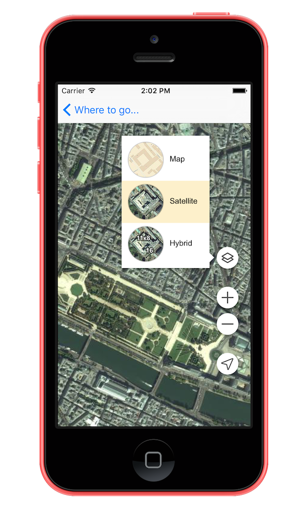

# MapsAPI

 
 


## Example

To run the example project, clone the repo, and run `pod install` from the Example directory first.

## Requirements

## Installation

MapsAPI is available through [CocoaPods](http://cocoapods.org). To install
it, simply add the following line to your Podfile:

```ruby
pod "MapsAPI"
```

## Author

Alexander Zinchuk, alexander@zinchuk.com

## License

MapsAPI is available under the MIT license. See the LICENSE file for more info.
